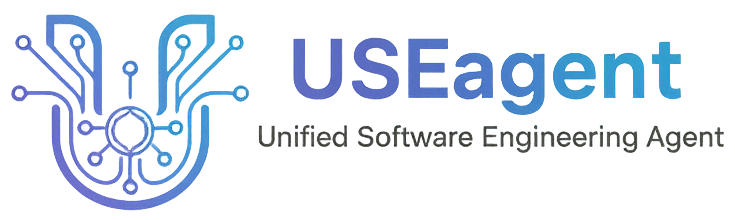
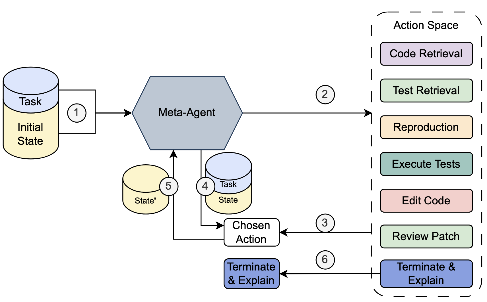

<p align="center">
  <a href="https://github.com/nus-apr/USEagent">
    
  </a>
</p>

<h1 align="center">USEagent: Unified Software Engineering Agent</h1>

<p align="center">
    <a href="arxiv_link"></a>
</p>


USEagent is the first unified software engineering agent built with a **top-down** abstraction. USEagent abstracts "unit of work" in software engineering into an individual _action_, based on software engineering practices. _Actions_ can be maintained and optimized separately. USEagent handles different types of software engineering tasks by dynamically orchestrating the actions.

<p align="center">
  <a href="https://arxiv.org/pdf/2506.14683">
    
  </a>
</p>


## Getting started


### Build USEagent with docker

It is **strongly recommended to run USEagent with docker containers**. The preferred mode is to to start a USEagent container and mount relevant files in as a copy.

Build **docker image** with just the agent:

```shell
DOCKER_BUILDKIT=1 docker build --build-arg USEBENCH_ENABLED=false -t useagent:dev .
```

Build image on top of existing image (useful when running on benchmarks, example script assumes you have a `my.project.to_work_on` image):

```shell
DOCKER_BUILDKIT=1 docker build --build-arg BASE_IMAGE=my.project.to_work_on --ssh default -t useagent:dev .
```

For working on USEbench, see [notes on usebench](./resources/USEBench-Instructions.md).


### Build USEagent without docker

If you are in an isolated/containerized environment, you may want to use USEagent directly:

[Install UV](https://docs.astral.sh/uv/getting-started/installation/)

```shell
uv sync
uv build
uv run <<args>>
```


### Run USEagent on local tasks

Example run in a (fresh) local folder:

```shell
mkdir ./useagent-tmp
echo "Hi, this is a simple file" > ./useagent-tmp/README.md

docker run --rm \
  --name useagent-test \
  -e GEMINI_API_KEY=YOUR_KEY_GOES_HERE \
  -v ./useagent-tmp:/input \
  useagent:dev \
  useagent local --model google-gla:gemini-2.0-flash --task-description 'write a shell file that prints a vegan tiramisu recipe' --output-dir /output --project-directory /input"
```

Inside the docker container, there will be a working-copy of your project created, so any files you mount in are *safe* and will remain unchanged.


### Run USEagent on Github Repository

Example will checkout the repository:

```shell

docker run --rm \
  --name useagent-test \
  -e GEMINI_API_KEY=YOUR_KEY_GOES_HERE \
  -v ./useagent-tmp-out:/output \
  useagent:dev \
  useagent github --model google-gla:gemini-2.0-flash --task-description 'write a shell file that prints a vegan tiramisu recipe' --repo-url https://github.com/octocat/Hello-World.git --output-dir /output"
```


### Run USEagent on other examples

There are more [example scripts](./scripts/) as well as [scripts to run on benchmarks](./scripts/experiments/).

They assume that the correct key (see below) are in a `.env` file and available in the runtime.


## Configuration

**Supported `--model`s:**

| Model                                | Required ENV        |
|--------------------------------------|---------------------|
| 'google-gla:gemini-2.0-flash'        | `GEMINI_API_KEY`    |
| 'openai:gpt-4o'                      | `OPENAI_API_KEY`    |
| 'anthropic:claude-3-5-sonnet-latest' | `ANTHROPIC_API_KEY` |

See more [at pydantic API Documentation](https://ai.pydantic.dev/models/)


## License / Terms of Agreement

Code within this project follows the [Apache 2.0 License](./LICENSE).

We further provide a local copy of the `gemma-3-4b-it` model, which comes with [terms of usage](./useagent/common/tokenizers/gemma-3-4b-it/TERMS_OF_USAGE.md).
Any usage or distribution must comply with them.


## Citation & Contact

A preprint is [available on arxiv](https://arxiv.org/abs/2506.14683).

To cite please use:

```
@inproceedings{applis2026unified,
  title={Unified Software Engineering Agent as AI Software Engineer},
  author={Applis, Leonhard and Zhang, Yuntong and Liang, Shanchao and Jiang, Nan and Tan, Lin and Roychoudhury, Abhik},
  booktitle={2026 IEEE/ACM 48th International Conference on Software Engineering (ICSE)},
  year={2026}
}
```

For queries, you can open an [issue](https://github.com/nus-apr/USEagent/issues), or contact [Yuntong Zhang](https://yuntongzhang.github.io/) (Email: zhang.yuntong@u.nus.edu).
